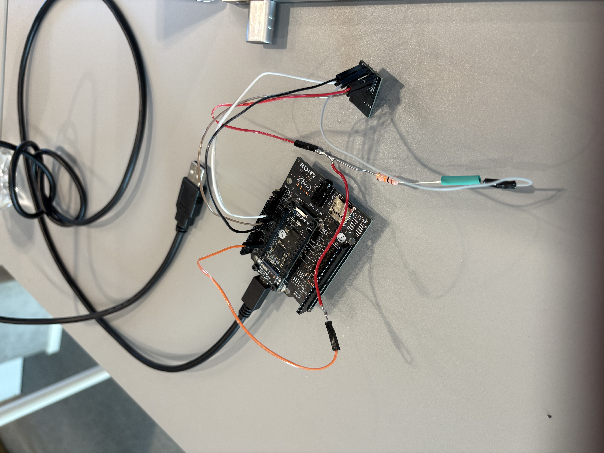
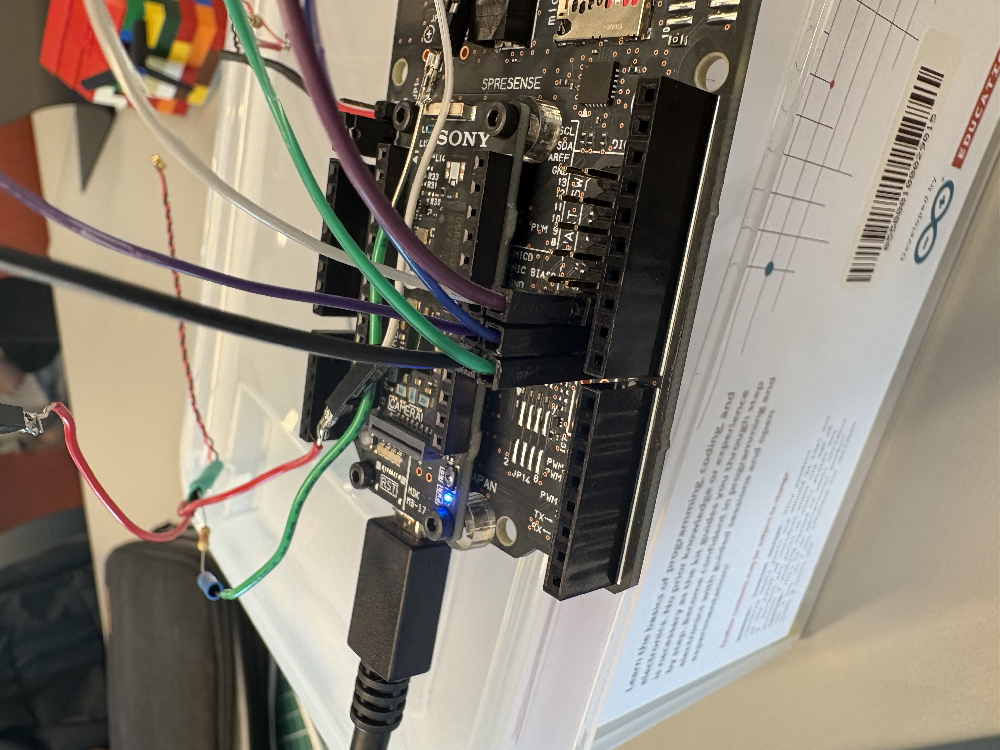
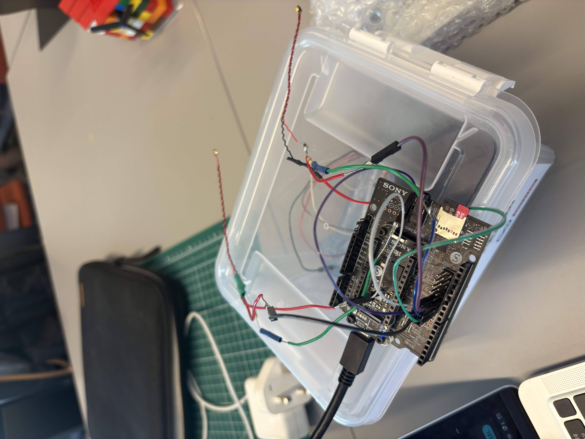
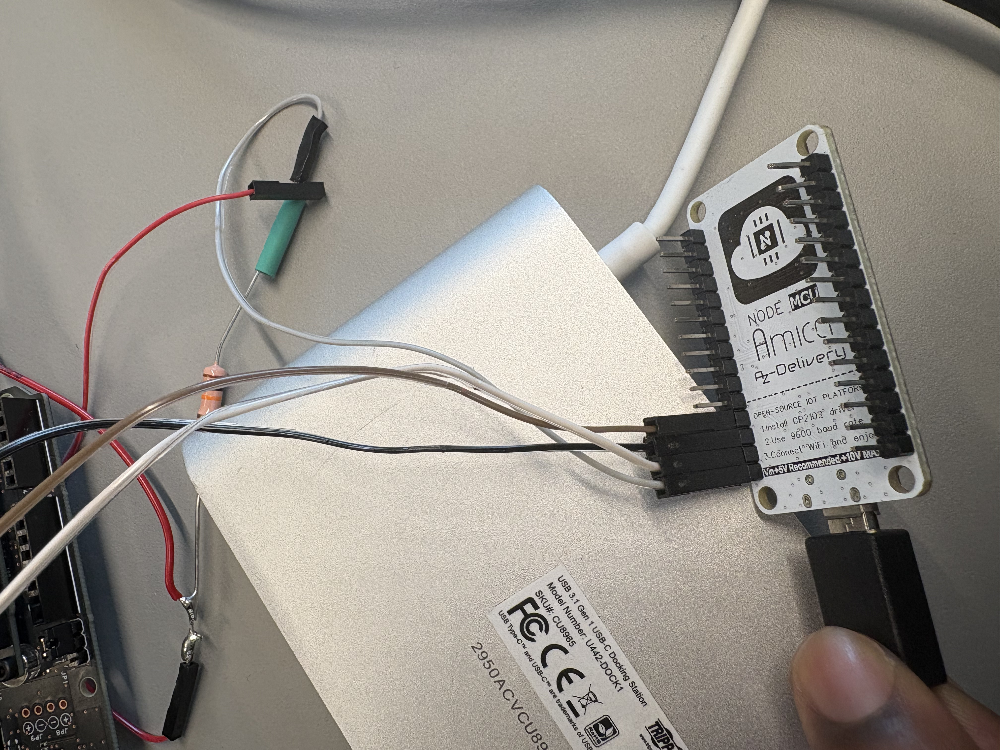
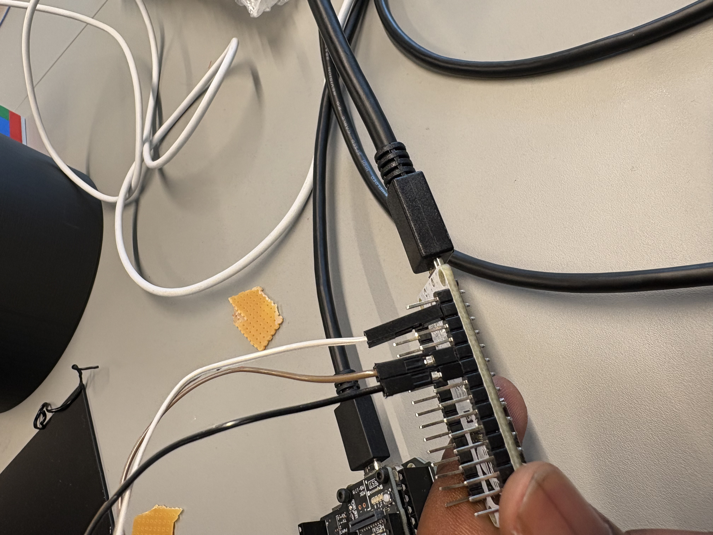
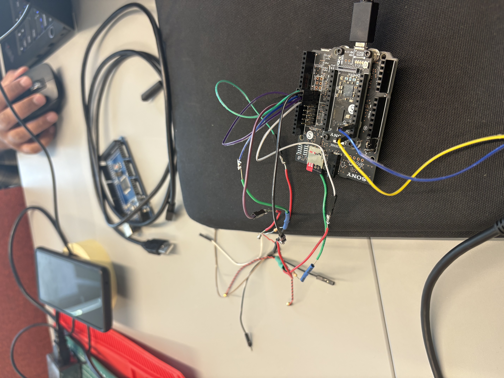
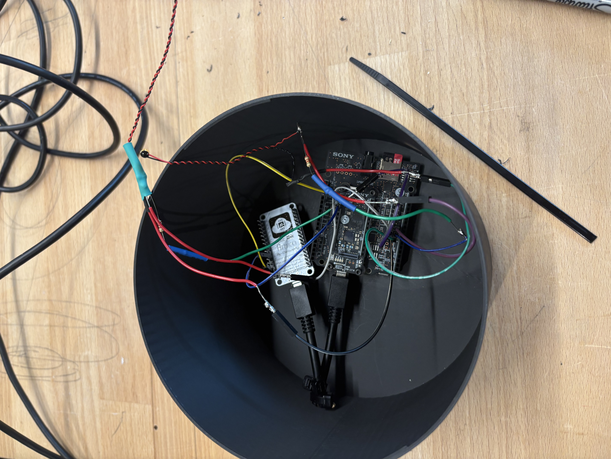
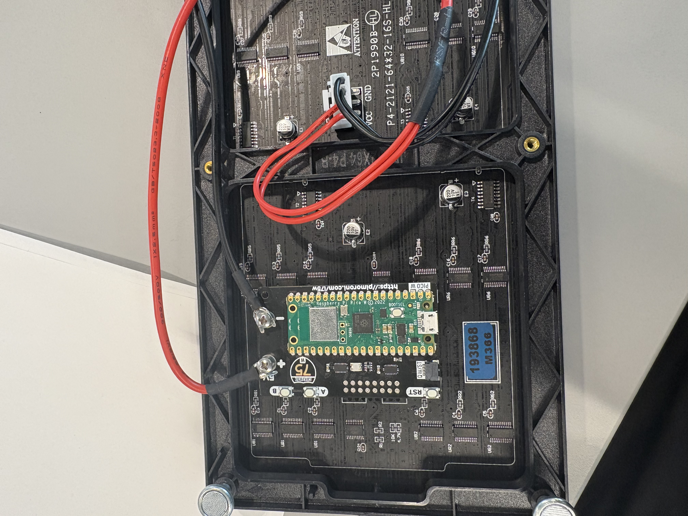
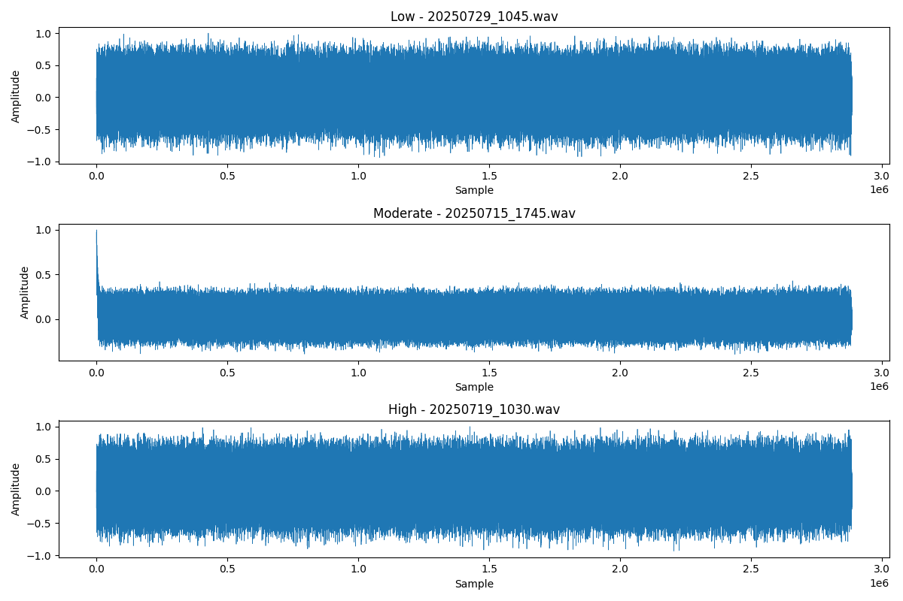

# Dissertation 

# Overview  

This project explores how non-speech acoustic sensing can be used as an artistic medium to represent human activity across connected spaces. Using the Sony Spresense microcontroller, over 500 one-minute stereo recordings were captured at 48 kHz and analyzed with simple audio features such as average energy and zero-crossing rate. These measures highlight trends in sound environments without relying on speech, helping reduce privacy risks while still offering meaningful interpretations of activity.  

A NodeMCU and LED matrix were used to translate this data into a visual form, inspired by fictional portals such as those in *Minecraft*. The result is a prototype installation that attempts to make invisible patterns of sound activity visible across locations.  

While the system faced technical limitations (such as storage constraints and connectivity issues), the project highlights both the creative potential and ethical challenges** of using acoustic sensing in artistic installations. It raises important questions around privacy, abstraction, and the role of data-driven art in shaping our understanding of connected spaces.

## Development

## Example Of Waveforms 

